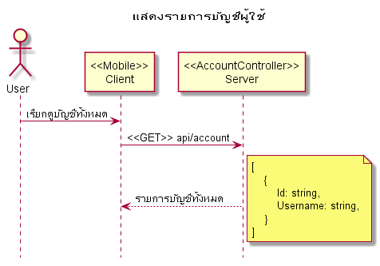
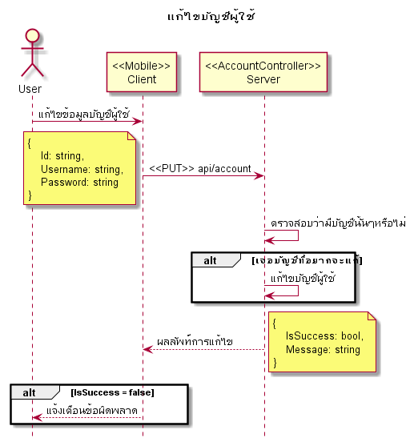
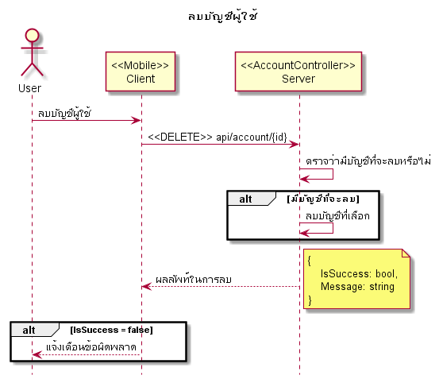

# Hotel, ระบบจองโรงแรม

## API
|Verb|Path|Remark|
|--|--|--|
|POST|api/account|Register|
|POST|api/account/login|Login|
|GET|api/account|แสดงรายการบัญชีทั้งหมดในระบบ|
|PUT|api/account|แก้ไขบัญชีผู้ใช้|
|DELETE|api/account/{id}|ลบบัญชีผู้ใช้|

## Features
1. Register
1. Login
1. Account management

## Diagrams
### Register
**Acceptance criteria**
1. ผู้ใช้สามารถสร้าง Account ใหม่ได้
1. Username จะต้องไม่ซ้ำกัน
1. ถ้าไม่สามารถสร้าง Account ได้จะต้องแจ้งสาเหตุให้ผู้ใช้ทราบ
1. Username & Password ขั้นต่ำสุดคือ 4 ตัวอักษร และ ไม่จำกัดความยาว

### Login
**Acceptance criteria**
1. ผู้ใช้สามารถเข้าสู่ระบบได้ด้วย Username & Password ที่สร้างไว้จาก **Register** module
1. กรณี Login ไม่สำเร็จจะต้องแจ้งสาเหตุให้ผู้ใช้ทราบ
1. กรณี Login สำเร็จ ระบบจะพาผู้ใช้ไปที่หน้า **Home**

### Account management
**Acceptance criteria**
1. แสดงรายการบัญชีผู้ใช้ทั้งหมดในระบบได้
1. แก้ไขบัญชีผู้ใช้ได้ Username, Password
1. ลบบัญชีผู้ใช้ได้
1. กรณีเกิดข้อผิดพลาด ระบบจะต้องแจ้งเตือนผู้ใช้
1. กฏในการตั้ง Username และ Password จะต้องเป็นไปตาม **Register** module

