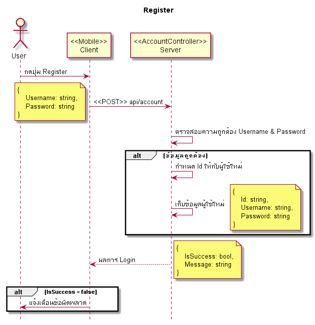
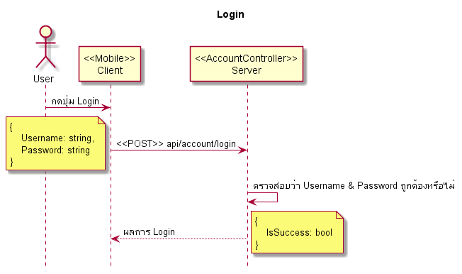

# Hotel, ระบบจองโรงแรม

## API
|Verb|Path|Remark|
|--|--|--|
|POST|api/account|Register|
|POST|api/account/login|Login|

## Features
1. Register
1. Login

## Diagrams
### Register
**Acceptance criteria**
1. ผู้ใช้สามารถสร้าง Account ใหม่ได้
1. Username จะต้องไม่ซ้ำกัน
1. ถ้าไม่สามารถสร้าง Account ได้จะต้องแจ้งสาเหตุให้ผู้ใช้ทราบ
1. Username & Password ขั้นต่ำสุดคือ 4 ตัวอักษร และ ไม่จำกัดความยาว

### Login
**Acceptance criteria**
1. ผู้ใช้สามารถเข้าสู่ระบบได้ด้วย Username & Password ที่สร้างไว้จาก **Register** module
1. กรณี Login ไม่สำเร็จจะต้องแจ้งสาเหตุให้ผู้ใช้ทราบ
1. กรณี Login สำเร็จ ระบบจะพาผู้ใช้ไปที่หน้า **Home**

